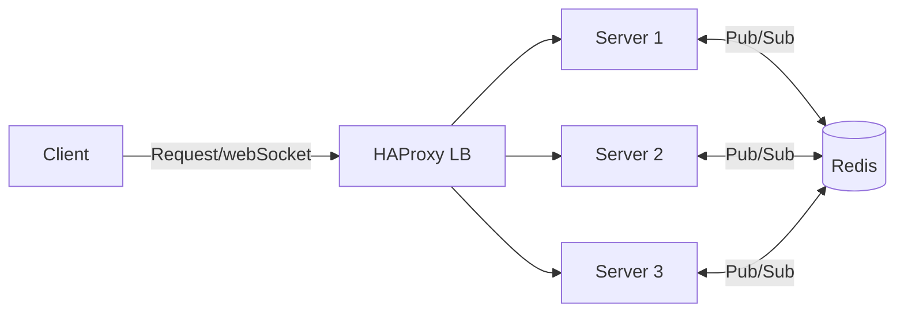

# GupShup - Scalable Chat APP
This is a Scalable full-stack real-time Chat application where Users can start a chat with a single user or create a group chat.

This app is built for scalability and speed and supports **multi-server socket scaling** using Redis, enabling horizontal scaling and real-time communication across multiple backend instances.

### Link: [gupshup-chat.vercel.app](https://gupshup-chat.vercel.app/)

## Tech Stack:
- **React.js** (frontend)
- **Node.js + Express** (backend)
- **MongoDB** (database)
- **Redis** (socket event sharing)

## Features
* Real-time Chat with single user or with a group chat
* Redis Pub/Sub to sync socket events across servers
* Horizontally scalable architecture
* Search users by name or email in the search bar
* Group creator has the admin control of the group chat
* Live typing indicators

##  Architecture Overview

## Website View

